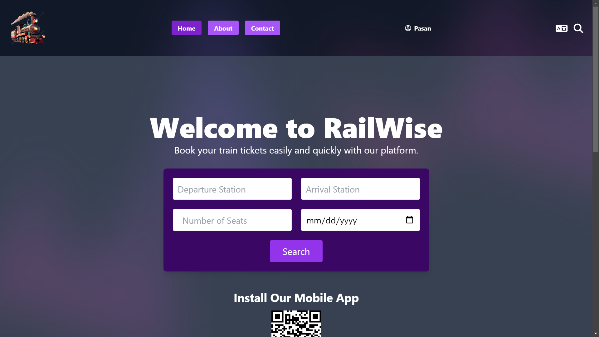

# RailWise - Train Booking System (Frontend)

## Overview



RailWise is a user-friendly train booking system designed to simplify the process of reserving train tickets online. Built using **Vite + React**, the web application offers users the ability to browse train schedules, select seats, and securely book tickets. The system also provides administrators with tools to manage train schedules, bookings, and generate analytical reports.

## Features

- **Search for Train Schedules**: Users can search for trains based on their travel preferences without logging in.
- **Book Tickets**: Registered users can book tickets by selecting preferred trains, schedules, and seats.
- **Real-time Seat Availability**: Users can view available seats in real-time.
- **Secure Payment Gateway**: Payments are handled securely, with integration through **Stripe**.
- **User Dashboard**: Users can review their booking history, update personal information, and manage current bookings.
- **Notifications**: Receive real-time notifications for booking confirmations, schedule changes, and cancellations.
- **Admin Panel**: Admins can manage train schedules, monitor system performance, and generate reports.

## Tech Stack

- **Frontend**: Vite, React, Tailwind CSS
- **Backend**: Node.js, Express (Separate Repository)
- **Database**: MongoDB
- **Payment Gateway**: Stripe (Test Mode)

## Installation and Setup

To get a copy of the project up and running on your local machine, follow these steps:

### Prerequisites

- **Node.js** (v14 or higher)
- **NPM** (v6 or higher) or **Yarn**
- **Vite** (for development)

### Clone the Repository

```bash
git clone https://github.com/EmyysJanaK/RailWise-Frontend-Web.git
cd RailWise-Frontend-Web
```

### Install Dependencies

```bash
npm install
```

or

```bash
yarn install
```

### Environment Variables

Create a `.env` file in the project root and add the following environment variables:

```bash
VITE_STRIPE_PUBLIC_KEY=<Your Stripe Secret Key>
VITE_EMAIL_VALIDATION_API_KEY=<Your Email Validation API Key>
VITE_BACKEND_URL=<Backend URL>
```

### Running the Application

To start the development server, use:

```bash
npm run dev
```

or

```bash
yarn dev
```

### Building for Production

To build the application for production, run:

```bash
npm run build
```

or

```bash
yarn build
```

This will generate the static files in the `dist` folder, which can be deployed to any static hosting service.

### Running Unit Tests

We use **Vitest** for unit testing. To run tests:

```bash
npm run test
```

or

```bash
yarn test
```

## Folder Structure

```bash
├── src
│   ├── assets              # Static assets (images, fonts)
│   ├── components          # Reusable components
│   ├── context             # React context providers
│   ├── hooks               # Custom hooks
│   ├── pages               # Application pages
│   ├── utils               # Utility functions
│   ├── App.jsx             # Main app component
│   └── main.jsx            # Application entry point
├── public                  # Public files
├── .env                    # Environment variables
├── vite.config.js          # Vite configuration
└── package.json            # Project dependencies and scripts
```

## Key Components

- **Home Page**: Displays available train routes and schedules.
- **Booking Process**: Allows users to select trains, seats, and proceed to payment.
- **User Dashboard**: Displays user bookings and allows cancellations or modifications.

## Contributions

The project is maintained by:

- **Sarathchandra D.M.P.M. (210577K)**
- **Senaratne R.R.S.N. (210592C)**
- **Senevirathne R.J.M. (210598B)**
